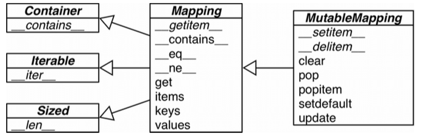
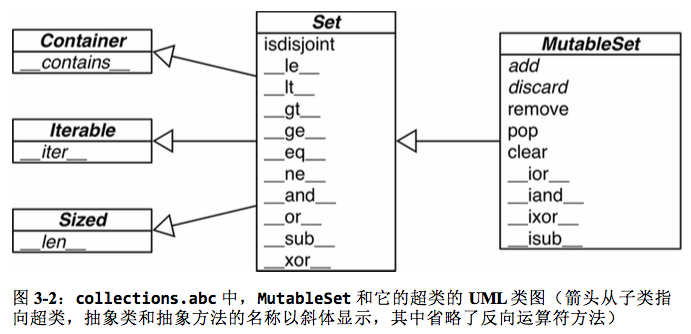
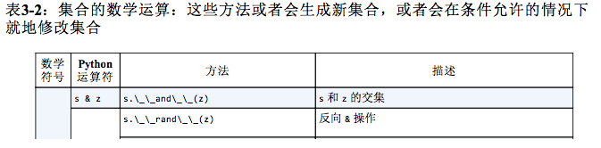
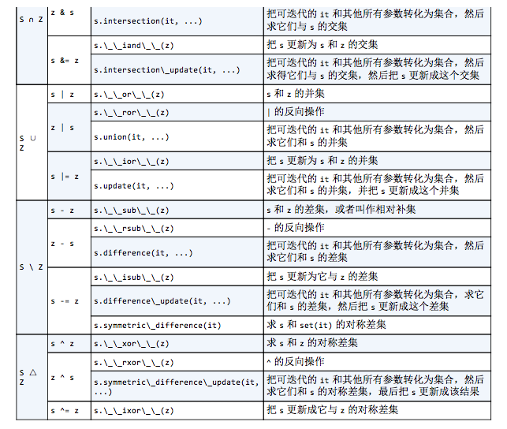
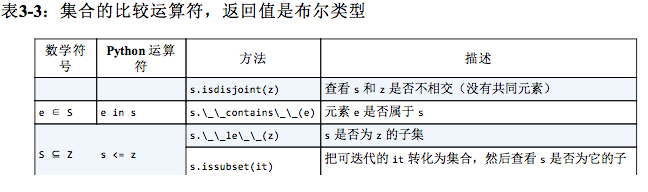
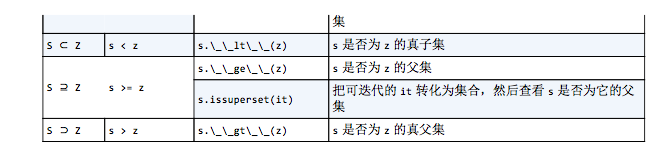

## `流畅的Python`读书笔记

### 第一部分 _序幕_

### 第1章 _Python数据模型_

> Python最好的品质之一是一致性。

**Python风格**(`Pythonic`)

**数据模型**其实是对Python框架的描述，它规范了这门语言自身构建**模块的接口**，这些模块包括但不限制序列,迭代器,函数,类,上下文管理器。

#### 特殊方法
被Python解释器调用，不要自己调用它.

比如：） `ojb[key]`的背后就是`__getitem__`方法

与之交互的有：<br/>
* 迭代<br/>
* 集合类<br/>
* 属性访问<br/>
* 运算符重载<br/>
* 函数和方法的调用<br/>
* 对象的创建和销毁<br/>
* 字符串表示形式和格式化<br/>
* 管理上下文(即with块)<br/>

昵称：**魔术方法**(`magic` method) <br/>
别称：**双下划线方法**(`dunder` method)

特殊方法一览

*表1-1: 跟运算符无关的特殊方法*

类别 					| 方法名
--------------------|------
字符串/字节序列表示形式	|  **`__repr__`**,**`__str__`**,`__format__`,`__bytes__`
数值转换 				| `__abs__`,`__bool__`,`__comlex__`,`__int__`,`__float__`,`__hash__`,`__index__`
集合模拟 				| **`__len__`**,`__getitem__`,`__setitem__`,`__delitem__`,`__contains__`
迭代枚举				| `__iter__`,`__reversed__`,`__next__`
可调用模拟				| `__call__`
上下文管理				| `__enter__`,`__exit__`
实例创建和销毁			| `__new__`,`__init__`,`__del__`
属性管理				| `__getattr__`,`__getattribute__`,`__setattr__`,`__delattr__`,`__dir__`
属性描述符 				| `__get__`,`__set__`,`__delete__`
根类相关的服务 			| `__prepare__`,`__instancecheck__`,`__subclasscheck__`

*表1-2: 跟运算符相关的特殊方法*

类别 					| 方法名和对应的运算符
--------------------|------------------
一元运算符				| `__neg__ -`, `__post__ +`, `__abs__ abs()`
众多比较运算符			| `__lt__ <`, `__le__ <=,` `__eq__ ==`, `__ne__ !=`, `__gt__ >`, `__ge__ >=`
算术运算符				| `__add__ +`, `__sub__` -, `__mul__ *`, `__truediv__ /`, `__floordiv__ //`, `__mod__ %`, `__divmod__ divmod()`, `__pow__ **或pow()`, `__round__ round()`
反向算术运算符			| `__radd__`, `__rsub__`, `__rmul__`, `__rtruediv__`, `__rfloordiv__`, `__rmod__`, `__rdivmod__`, `__rpow__`
增量赋值算术运算符		| `__iadd__`, `__isub__`, `__imul__`, `__itruediv__`, `__ifloordiv__`, `__imod__`, `__ipow__`
位运算符				| `__invert__ ~`, `__lshift__ <<`, `__rshift__ >>`, `__and__ &`, `__or__ |`, `__xor__ ^`
反向位运算符			| `__rlshift__`, `__rrshift__`, `__rand__`, `__rxor__`, `__ror__`
增量赋值位运算符		| `__irlshift__`, `__irrshift__`, `__irand__`, `__irxor__`, `__iror__`

当交换两个操作数的位置时，就会调用反向运算符(b * a而不是a * b)

增量赋值运算符提供赋值运算捷径(a = a * b变成a *= b)

------------------

### 第二部分 _数据结构_

### 第2章 _序列构成的数组_

* __容器序列__ （能存放*不同类型*的数据）
	* 	list 列表
	* 	tuple 元组 (不可变序列)
	* 	collections.deque 双向队列	
* __扁平序列__ （只能容纳*一种类型*）
	* str 字符串 (不可变序列)
	* bytes (不可变序列)
	* bytearray
	* memoryview
	* array.array


#### 列表推导 (listcomps)

构建列表(list)的快捷方式

可读性强

```
>>> symbols = '$&UI*&li'
>>> beyond_ascii = [ord(s) for s in symbols if ord(s) > 64]
>>> beyond_ascii
[85, 73, 108, 105]

>>> colors = ['black', 'white']
>>> sizes = ['S', 'M', 'L']
>>> tshirts = [(color, size) for size in sizes
...                          for color in colors]
>>> tshirts
[('black', 'S'), ('white', 'S'), ('black', 'M'), ('white', 'M'), ('black', 'L'), ('white', 'L')]
```

#### 生成器表达式 (genexps)
 构建任何类型序列的快捷方式

元组,数组或其它序列类型,更好的选择是生成器表达式.

语法跟列表推导差不多，只是把`[]`换成`()`.

```
>>> symbols = '$&^%$*&'
>>> tuple(ord(symbol) for symbol in symbols)
(36, 38, 94, 37, 36, 42, 38)
>>> import array
>>> array.array('I', (ord(symbol) for symbol in symbols))
array('I', [36L, 38L, 94L, 37L, 36L, 42L, 38L])
```

#### 元组 (tuple)

* 不可变序列
* 可以做记录

**元组拆包**

* `_`可作占位符
* `*`运算符
* 支持嵌套元组拆包

**具名元组**

`collections.namedtuple` (工厂函数)

专有属性

* _fields
* _make()
* _asdict()
* ...

列表或元组的方法和属性

 					| 列表 | 元组 | 说明
--------------------|----- |-----|-------
`s.__add__(s2)	`	| * | * | s + s2 拼接
`s.__iadd__(s2)` | * | | s += s2
s.append(e)		| * | | 在尾部添加一个新元素
s.clear() |  * | | 删除所有元素
`s.__contains__(e)` | * | * | s是否包含e
s.copy() | * | | 列表的浅复制
s.count(e) | * | * | e在s中出现的次数
`s.__delitem__(p)` | * | | 把位于p的元素删除
s.extend(it) | * | |  把可迭代对象it追加给s
`s.__getitem__(p)` | * | * | s[p]
`s.__getnewargs__()` |  | * | 在pickle中支持更加优化的序列化
s.index() | * | * | 在s中找到元素e第一次出现的位置
s.insert(p, e) | * | | 在位置p之前插入元素e
`s.__iter__()` | * | * | 获取s的迭代器
`s.__len__()` | * | * | len(s)
`s.__mul__(n)` | * | * | s * n
`s.__imul__(n)` | * | |  s *= n
`s.__rmul__(n)` | * | * | n * s
s.pop([p]) | * | | 删除最后或者是(可选的)位于p的元素,并返回它的值
s.remove(e) | * | | 删除s中的第一次出现的e
s.reverse() | * | | 就地把s的元素倒序排序
`s.__reversed__()` | * | | 返回s的倒序迭代器
`s.__setitem__(p, e)` | * | | s[p] = e
s.sort([key], [reverse]) | * | | 就地对s中的元素进行排序，可选参数有键(key)和是否倒序

#### 切片

列表(list),元组(tuple),和字符串(str)这类序列类型都支持切片.

格式：`seq[start:stop:step]`

其实是Python调用了`seq.__getitem__(slice(start,stop,step))`

```
>>> l = [10, 20, 30, 40, 50, 60]
>>> l[:2]
[10, 20]
>>> l[2:]
[30, 40, 50, 60]
>>> l[3:]
[40, 50, 60]
>>> l[:3]
[10, 20, 30]
>>> l[:]
[10, 20, 30, 40, 50, 60]
>>> l[2:3]
[30]
>>> l[2:2]
[]
>>> s = 'bicycle'
>>> s[::3]
'bye'
>>> s[::-1]
'elcycib'
>>> s[::-2]
'eccb'
>>> 
>>> 
>>> SKU = slice(0, 6)
>>> l[SKU]
[10, 20, 30, 40, 50, 60]
```

**多维切片和省略**

`a[i,j]`
`a[m:n, k:l]`

`a[i:...]`

**给切片赋值**

```
>>> l = list(range(10))
>>> l
[0, 1, 2, 3, 4, 5, 6, 7, 8, 9]
>>> l[2:5] = [20, 30]
>>> l
[0, 1, 20, 30, 5, 6, 7, 8, 9]
>>> del l[5:7]
>>> l
[0, 1, 20, 30, 5, 8, 9]
>>> l[3::2] = [11, 22]
>>> l
[0, 1, 20, 11, 5, 22, 9]
>>> l[2:5] = 100
Traceback (most recent call last):
  File "<stdin>", line 1, in <module>
TypeError: can only assign an iterable
>>> l[2:5] = [100]
>>> l
[0, 1, 100, 22, 9]
```

#### 序列操作

```
>>> l = [1, 2, 3]
>>> l * 5
[1, 2, 3, 1, 2, 3, 1, 2, 3, 1, 2, 3, 1, 2, 3]
>>> 5 * 'abcd'
'abcdabcdabcdabcdabcd'
>>> 
>>> 
>>> weird_board = [['_'] * 3] * 3
>>> weird_board
[['_', '_', '_'], ['_', '_', '_'], ['_', '_', '_']]
>>> weird_board[1][2] = 'O'
>>> weird_board
[['_', '_', 'O'], ['_', '_', 'O'], ['_', '_', 'O']]
```

```
>>> l = [1 ,2, 3]
>>> id(l)
4501905848
>>> l *= 2
>>> l
[1, 2, 3, 1, 2, 3]
>>> id(l)
4501905848
>>> t = (1, 2, 3)
>>> id(t)
4501601728
>>> t *= 2
>>> t
(1, 2, 3, 1, 2, 3)
>>> id(t)
4501727864
```

```
>>> fruits = ['grape', 'raspberry', 'apple', 'banana']
>>> sorted(fruits)
['apple', 'banana', 'grape', 'raspberry']
>>> fruits
['grape', 'raspberry', 'apple', 'banana']
>>> sorted(fruits, reverse=True)
['raspberry', 'grape', 'banana', 'apple']
>>> sorted(fruits, key=len)
['grape', 'apple', 'banana', 'raspberry']
>>> sorted(fruits, key=len, reverse=True)
['raspberry', 'banana', 'grape', 'apple']
>>> fruits
['grape', 'raspberry', 'apple', 'banana']
>>> fruits.sort()
>>> fruits
['apple', 'banana', 'grape', 'raspberry']
```

`bisect模块` bisect insort 利用二分查找算法来在有序序列中查找或插入元素

#### 数组 (array)

创建数组需要一个类型码,这个类型码用来表示在底层的C语言应该存放的数据类型。

b类型码代表 signed char
d类型码代表 浮点类型

```
>>> from array import array
>>> from random import random
>>> floats = array('d', (random() for i in range(10)))
>>> floats[-1]
0.12299425345504178
```

#### 内存视图 (memoryview)


#### NumPy SciPy

#### 双向队列 collections.deque

* 线程安全
* 快速
* 从两端添加和删除元素

其它队列

* queue
* multiprocessing
* asyncio
* heapq


### 第2章 _字典和集合_

`字典 (dict)`

`集合 (set)`

##### 泛映射类型



可散列类型：
> 如果一个对象是可散列的，那么在这个对象的生命周期中，它的散列值是不变的，而且这个对象需要实现`__hash__()`方法。另外可散列对象还要有`__qe__()`方法,这样才能跟其它键做比较。如果两个可散列对象是相等的，那么它们的散列值一定是一样的......

字典多种构造方法

```
>>> a = dict(one=1, two=2, three=3)
>>> b = {'one':1, 'two':2, 'three':3}
>>> c = dict(zip(['one','two','three'],[1,2,3]))
>>> d = dict([('two', 2),('one', 1),('three', 3)])
>>> e = dict({'three':3, 'one': 1, 'two': 2})
>>> a == b == c == d == e
True
>>> a
{'three': 3, 'two': 2, 'one': 1}
```

##### 字典推导

```
>>> 
>>> DIAL_CODES = [
... (86, 'China'),
... (91, 'India'),
... (1, 'United States'),
... (62, 'Indonesia')
... ]
>>> country_code = {country: code for code, country in DIAL_CODES}
>>> coutry_code
{'United States': 1, 'India': 91, 'Indonesia': 62, 'China': 86}
>>> {code: country.upper() for country, code in country_code.items() if code < 66}
{1: 'UNITED STATES', 62: 'INDONESIA'}
```

##### 常见的映射方法

		| dict | defaultdict | OrderedDict | 说明
--------|----- |-----|------- | -----
d.clear() | * | * | * | 移除所有元素
`d.__contations__(k)` | * | * | * | 检查k是否在d 
d.copy() | * | * | * | 浅复制
`d.__copy__()` | |  * | | 用于支持copy.cpyy
d.default_factory() | |  * | | 在`__missing__`函数中被调用的函数,用以给未找到的元素设置值
`d.__delitem__(k)` | * | * | * | del d[k]
d.fromkeys(it,[initial]) | * | * | * | 将迭代器it里的元素设置为映射里的键，如果有initial参数，就把它作为这些键对应的值(默认是None)
d.get(k,[default]) | * | * | * | 返回键k对应的值，如果字典里没有键k,则返回None或default
`d.__getitem__(k)` | * | * | * | d[k]
d.items() | * | * | * | 返回d里所有的键值对
`d.__iter__()` | * | * | * | 获取键的迭代器
d.keys() | * | * | * | 获取所有的键
`d.__len__()` | * | * | * | len(d)
`d.__missing__(k)` | |  * | | 当__gettitem__找不到对应键的时候，这个方法会被调用
d.move_to_end(k, [last]) | |  | * | 把键为k的元素移动到最靠前或者最靠后的位置
d.pop(k, [defaul]) | * | * | * | 返回键k所对应的值
d.popitem() | * | * | * | 随机返回一个键值对并从字典里移除它
`d.__reversed__()` | |  | * | 返回倒序对键的迭代器
d.setdefault(k, [default]) | * | * | * | 
`d.__setitem__(k, v)` | * | * | * | d[k] = v
d.update(m, [**kargs]) | * | * | * | m可以是映射或者键值对迭代器,用来更新d里对应的条目
d.values() | * | * | * | 返回字典里的所有值

##### 字典的变种

* collections.OrdereDict
* collections.ChainMap
* collections.Counter
* collections.UserDict

##### 子类化UserDict

创造自定义映射类型

```
import collections

class StrKeyDict(collections.UserDict):
	
	def __missing__(self, key):
		if isinstance(key, str):
			raise KeyError(key)
		return self[str(key)]
		
	def __contains__(self, key):
		return str(key) in self.data
		
	def __setitem__(self, key):
		self.data[str(key)] = item
```

##### 不可变映射类型

types.MappingProxyType

#### 集合论

`set`
`frozenset`

* `a | b` _合集_
* `a & b` _交集_
* `a - b` _差集_

#### 集合的操作








*表3-4: 集合类型的其它方法*

		| set | frozenset | 描述
------|----- |----- | -----
s.add(e) | * |  | 把元素e添加到s
s.clear() | * |   | 移除掉s中的所有元素
s.copy() | * |   * | 对s浅复制
s.discard(e) | * |  | 如果s里有e这个元素的话,把它移除
`s.__iter__()` |  * |  * | 返回s的迭代器
`s.__len__()` |  * |  * | len(s)
s.pop() |  * |   | 从s中移除一个元素并返回它的值，若s为空，则抛出KeyError异常
s.remove(e) | * |    | 从s中移除e元素，若e元素不存在，则抛出KeyError异常


### 第4章 _文本和字节序列_

